# 📡 StreamWire

<p align="center">
  
  
  
  
  
  
  
  
  
  
  
</p>

<p align="center">
  <strong>Connect. Shield. Stream.</strong><br/>
  A social platform for authenticated discussion, anonymous posting, and video streaming.
</p>

---

StreamWire is a full-stack social media app that explores identity and anonymity. It includes three content experiences: **Wire** (Public), **Shadows** (Anonymous), and **Cinema** (Video), built on a MERN stack with AI features and privacy-first design.

---

## 🌟 Key Features

### 📢 The Wire (Public Feed)

- **Authenticated Discourse**: Social feed where identity is front and center
- **Rich Posts**: Text, image attachments, and integrated voting polls
- **Trend Score Algorithm**: Smart sorting based on recency, engagement, and unique views
- **Stealth Toggle**: Dynamically mask or reveal identity on any post
- **Optimistic UI**: Instant like/comment feedback with server rollback on failure

### 👻 Shadows (Anonymous Feed)

- **True Anonymity**: Post and comment without revealing identity
- **Kill Switch**: Instantly cloak your entire profile and content history
- **AuthLock**: Browse freely as a guest, with authentication required only for interactions
- **Stealth Comments**: Participate in public threads anonymously

### 🎬 Cinema (Video Streaming)

- **Custom Video Player**: Speed controls, Picture-in-Picture, theater mode, keyboard shortcuts
- **AI-Powered** (Groq):
  - Auto-transcription via Whisper
  - AI-generated descriptions and SEO tags
  - On-demand video summarization
  - Conversational Q&A about video content
- **Engagement**: Like, subscribe, pin comments, and "Watch Later" library
- **Compression**: Server-side FFmpeg two-pass compression for optimized storage
- **Personalized "For You" Feed**: Built from watch history + selected tag preferences

### 🧠 Smart Features

- **Optimistic UI**: Instant feedback on likes and comments, with rollback on failure
- **Multi-Device Sessions**: Up to 5 concurrent logins with JWT refresh token rotation
- **View Deduplication**: TTL-based unique view tracking (1 view per user per 12 hours)
- **Trending Page**: Cross-platform trending across Cinema, Wire, and Shadows
- **Channel Pages**: Full creator profiles with public/private mode and identity cloaking
- **Creator Studio**: Dashboard with analytics, video/wire management, and stealth post tracking

---

## 🛠️ Technology Stack

### Frontend

| Layer   | Technology                                                 |
| ------- | ---------------------------------------------------------- |
| Core    | React 19, Vite 7                                           |
| State   | Redux Toolkit (Auth) + TanStack React Query (Server State) |
| Styling | Tailwind CSS v4 + Framer Motion                            |
| HTTP    | Axios with auto JWT refresh + request queueing             |
| Forms   | React Hook Form                                            |
| Routing | React Router v7                                            |
| Icons   | Lucide React                                               |

### Backend

| Layer      | Technology                                   |
| ---------- | -------------------------------------------- |
| Runtime    | Node.js (ES Modules), Express 5              |
| Database   | MongoDB + Mongoose 9 (Aggregation Pipelines) |
| Auth       | JWT (HTTP-Only Cookies) + bcrypt             |
| Validation | Zod schemas                                  |
| Security   | Helmet, express-rate-limit, CORS             |
| Media      | Cloudinary + Fluent-FFmpeg                   |
| AI         | Groq SDK (Whisper + Llama 3.3)               |
| Email      | Nodemailer (Gmail App Passwords)             |
| Scheduling | node-cron (daily trend score updates)        |
| Logging    | Morgan                                       |

---

## 📂 Project Structure

```
StreamWire/
├── Backend/                           # Node.js + Express API
│   ├── src/
│   │   ├── app.js                         # Express config + health check
│   │   ├── index.js                       # Server startup + graceful shutdown
│   │   ├── controllers/                   # 11 request handlers
│   │   ├── models/                        # 13 Mongoose schemas
│   │   ├── routes/                        # 10 route modules (/api/v1/*)
│   │   ├── middlewares/                   # Auth, Multer, Zod validation, rate limiters
│   │   ├── validations/                   # 8 Zod schema files
│   │   ├── utils/                         # 12 utilities (AI, FFmpeg, Cloudinary, etc.)
│   │   ├── services/                      # JWT + Video AI services
│   │   ├── cron/                          # Trend score cron job
│   │   └── db/                            # MongoDB connection
│   ├── .env.example
│   └── package.json
│
├── Frontend/                          # React 19 + Vite Client
│   ├── src/
│   │   ├── pages/                         # 25 route-level pages
│   │   ├── Components/                    # Reusable UI (26 components, 7 subdirs)
│   │   ├── api/                           # Axios instance + 10 service modules
│   │   ├── store/                         # Redux store + auth slice
│   │   ├── utils/                         # Formatters + image compressor
│   │   └── assets/                        # Static images
│   ├── public/                            # sitemap.xml, robots.txt
│   └── package.json
│
├── screenshots/                       # App screenshots
├── README.md                          # This file
└── LICENSE                            # MIT License
```

---

## 🚀 Getting Started

### Prerequisites

- Node.js v18+
- MongoDB (local or [Atlas](https://www.mongodb.com/atlas))
- Cloudinary account
- Groq API key
- Gmail with App Password (for emails)
- FFmpeg installed system-wide

### Installation

1. **Clone the repository**

   ```bash
   git clone https://github.com/HiteshShonak/StreamWire.git
   cd StreamWire
   ```

2. **Backend Setup**

   ```bash
   cd Backend
   npm install
   cp .env.example .env    # Fill in your credentials
   npm run dev
   ```

3. **Frontend Setup**

   ```bash
   cd Frontend
   npm install
   npm run dev
   ```

4. **Access the app** at `http://localhost:5173`  
   API health check: `http://localhost:8000/api/v1/health`

---

## 🛡️ Security Features

| Feature               | Implementation                                         |
| --------------------- | ------------------------------------------------------ |
| HTTP Security Headers | Helmet middleware                                      |
| Rate Limiting         | Granular per-route-group limiters                      |
| Authentication        | JWT in HTTP-Only cookies with refresh token rotation   |
| Session Management    | 5-device limit with FIFO eviction + reuse detection    |
| Input Validation      | Zod schemas on all mutation endpoints                  |
| Password Storage      | bcrypt with salt rounds                                |
| Identity Privacy      | Configurable stealth mode + identity cloaking          |
| View Anti-Spam        | TTL-indexed deduplication (1 view / 12hr / user)       |
| Auto Token Refresh    | Axios interceptor with request queueing during refresh |

---

## 📸 Screenshots

<table>
  <tr>
    <td><strong>🏠 Home</strong><br/>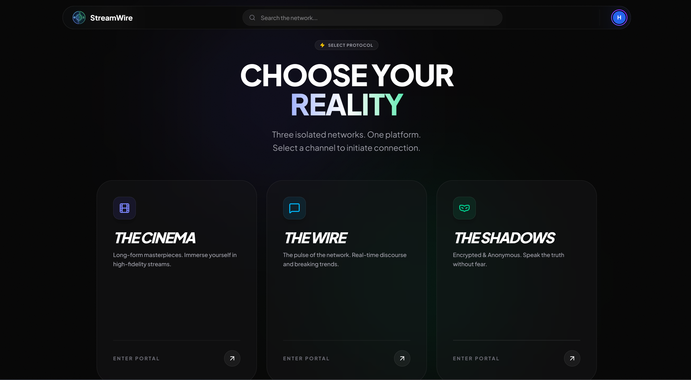</td>
    <td><strong>🛬 Landing Page</strong><br/>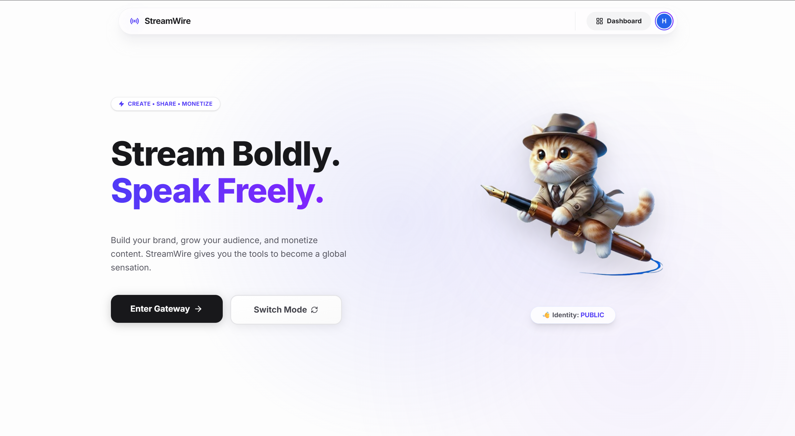</td>
  </tr>
  <tr>
    <td><strong>⚡ The Wire - Public Feed</strong><br/>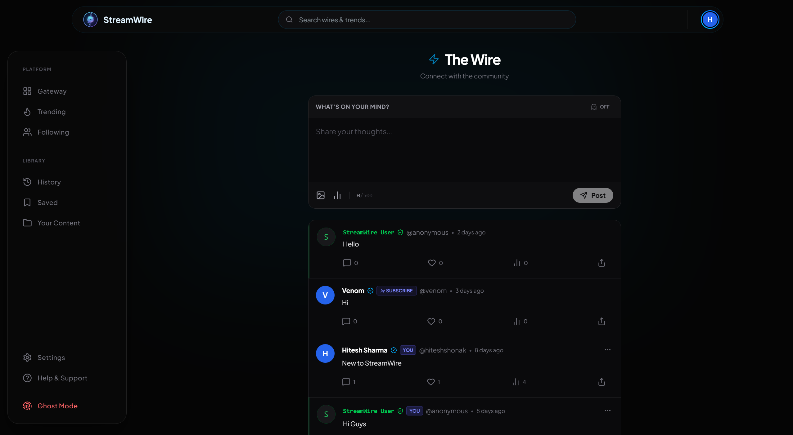</td>
    <td><strong>👻 The Shadows - Anonymous Feed</strong><br/>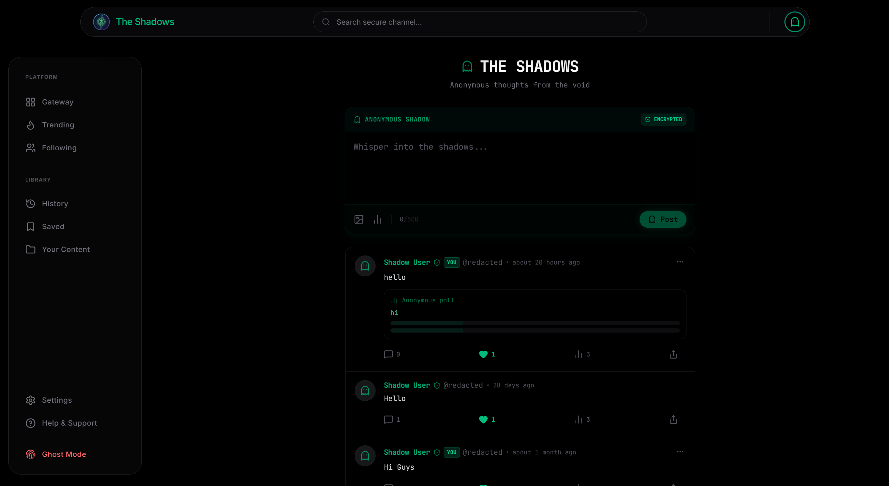</td>
  </tr>
  <tr>
    <td><strong>🎬 Cinema - Video Discovery</strong><br/>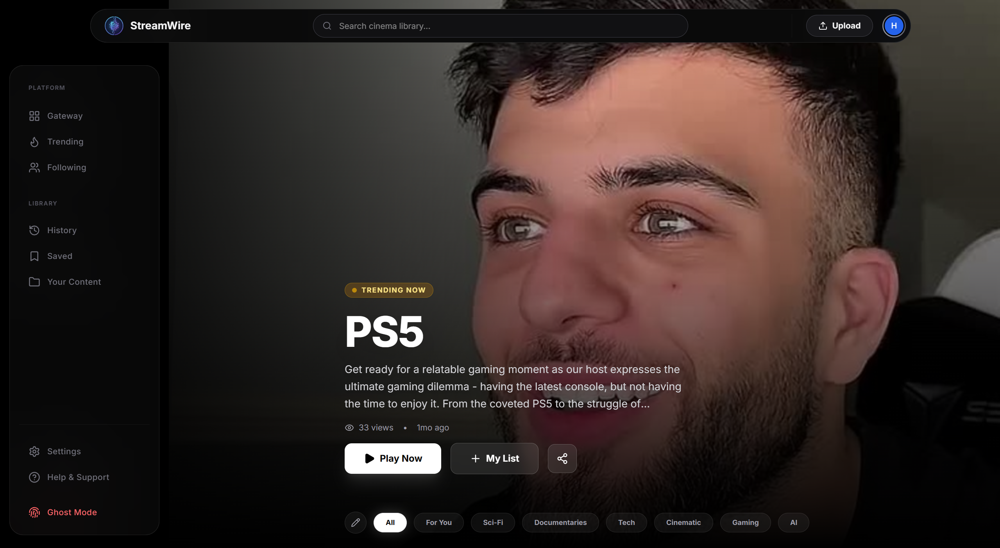</td>
    <td><strong>▶️ Video Player</strong><br/>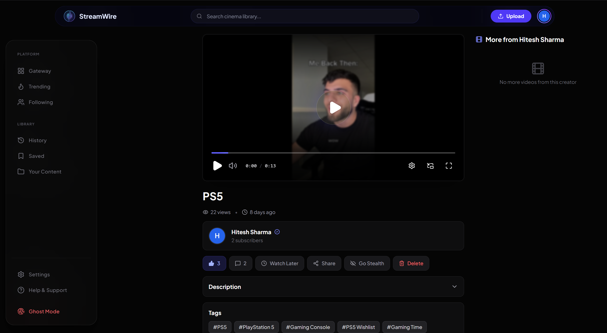</td>
  </tr>
  <tr>
    <td><strong>🤖 AI Features - Summarization & Q&A</strong><br/>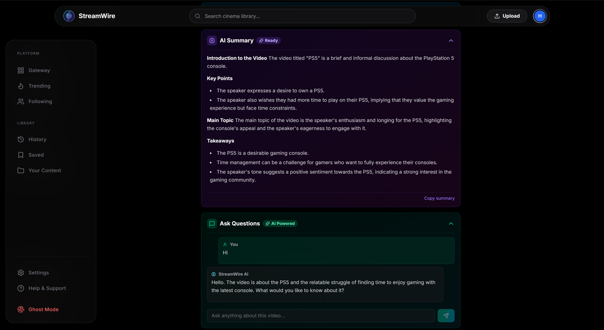</td>
    <td><strong>📊 Creator Studio - Dashboard</strong><br/>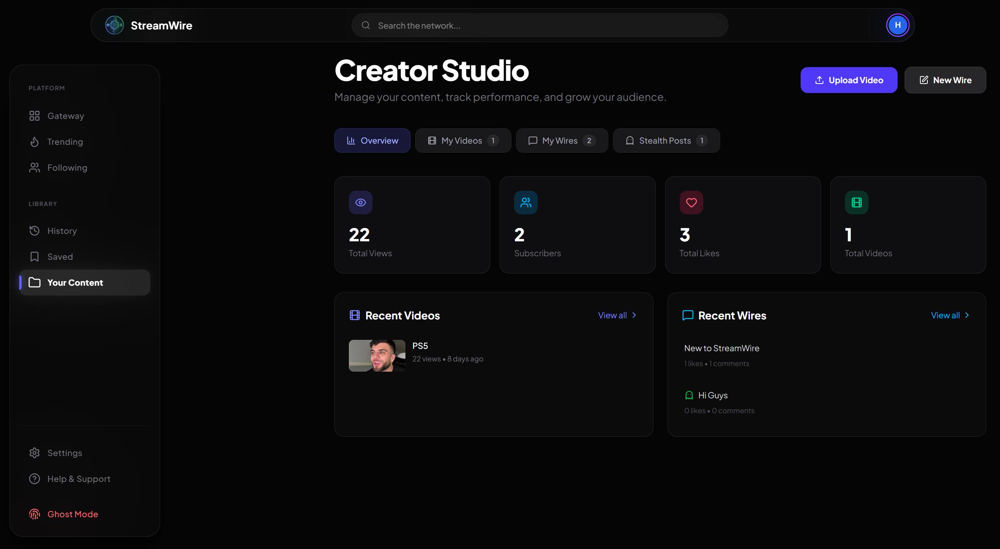</td>
  </tr>
  <tr>
    <td><strong>🔥 Trending - Cross-Platform</strong><br/>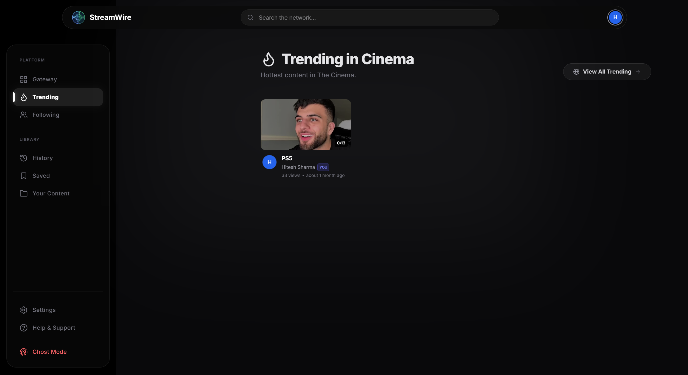</td>
    <td><strong>👤 Channel Page</strong><br/>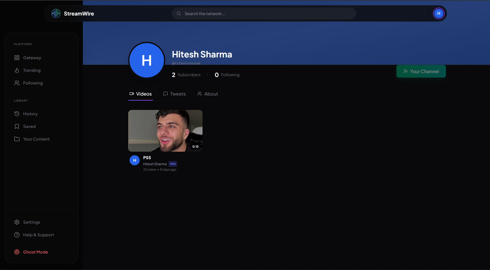</td>
  </tr>
  <tr>
    <td><strong>🔐 Login</strong><br/>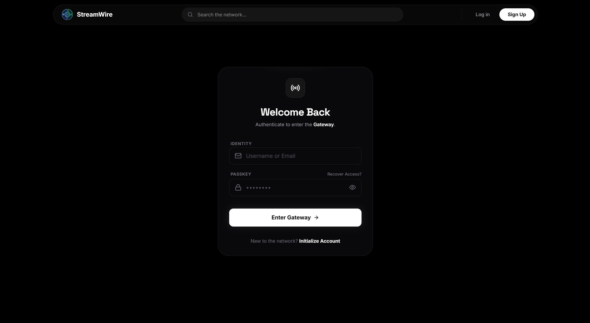</td>
    <td><strong>📝 Register</strong><br/>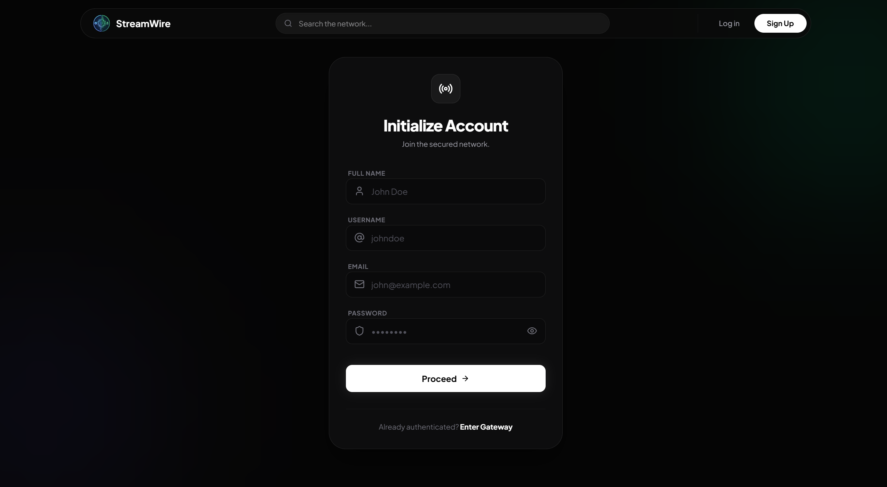</td>
  </tr>
  <tr>
    <td><strong>🎨 Customize / Onboarding</strong><br/>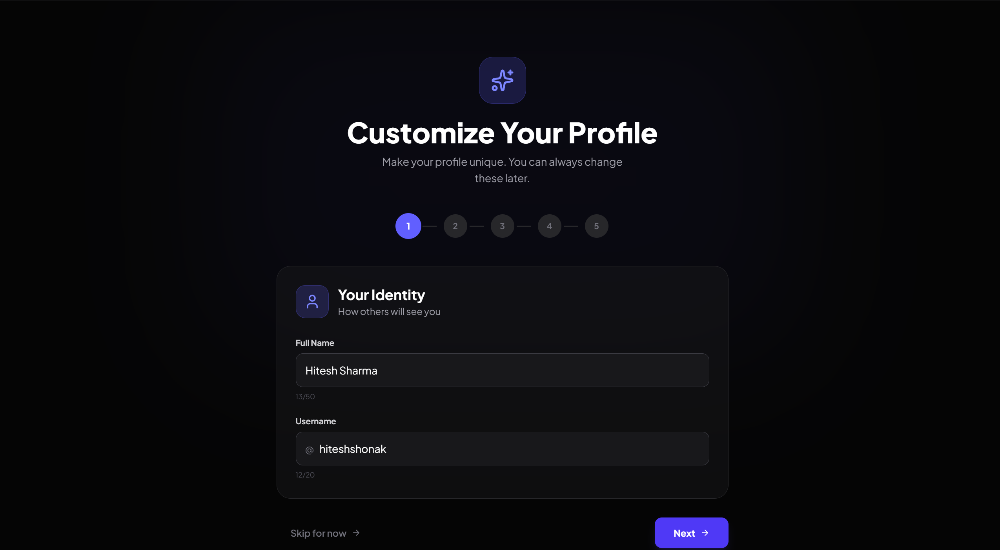</td>
    <td><strong>⚙️ Settings</strong><br/>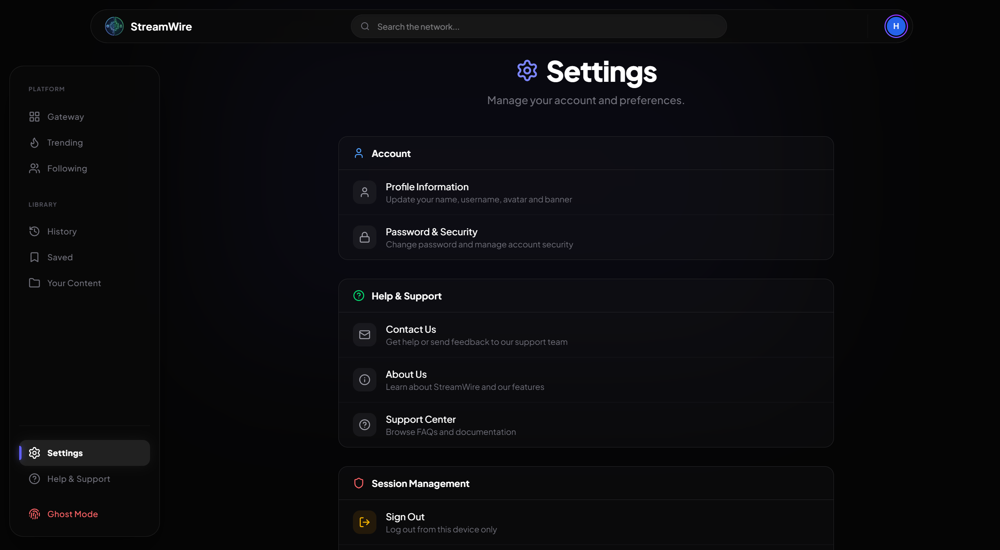</td>
  </tr>
</table>

---

## 🗺️ Pages Overview

| Page            | Route                | Description                                   |
| --------------- | -------------------- | --------------------------------------------- |
| Landing         | `/`                  | Marketing landing page with AI feature demos  |
| Wire Feed       | `/wire`              | Authenticated public social feed              |
| Shadows Feed    | `/shadows`           | Anonymous posting feed                        |
| Cinema Feed     | `/cinema`            | Video discovery with hero + category filters  |
| Video Player    | `/watch/:id`         | Full-featured custom video player + AI        |
| Dashboard       | `/dashboard`         | Creator Studio with stats, content, & stealth |
| Trending        | `/trending`          | Cross-platform trending content               |
| Channel         | `/channel/:username` | Creator profiles with subscriber management   |
| Build Feed      | `/build-feed`        | Customize "For You" video preferences         |
| History         | `/history`           | Personal watch history                        |
| Saved           | `/saved`             | Watch Later + Saved Playlists                 |
| Following       | `/following`         | Subscription management                       |
| Settings        | `/settings`          | Account & privacy settings                    |
| Customize       | `/customize`         | Profile wizard (avatar, cover, bio, colors)   |
| Kill Switch     | `/kill-switch`       | Toggle identity cloaking globally             |
| About           | `/about`             | Platform feature showcase                     |
| Contact         | `/contact`           | Contact the team                              |
| Login           | `/login`             | Authentication gateway                        |
| Register        | `/register`          | Account initialization + OTP verification     |
| Forgot Password | `/forgot-password`   | Password recovery flow                        |

---

## 🤝 Contribution

This is a portfolio project built to show practical full-stack work. Feedback and contributions are welcome.

---

## 📝 License

This project is licensed under the MIT License. See the [LICENSE](./LICENSE) file for details.

---

© 2026 StreamWire. Built with ❤️ by [Hitesh Sharma](https://github.com/HiteshShonak).
